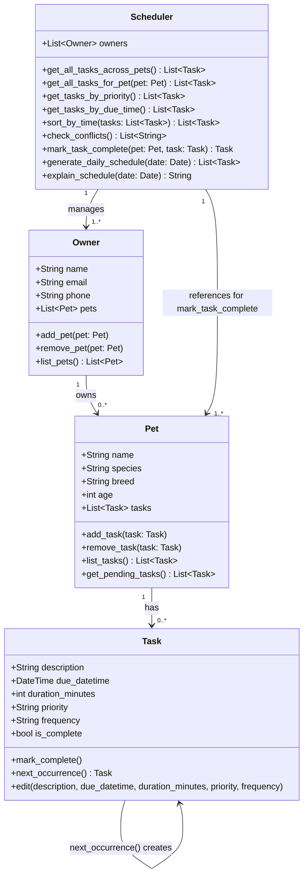

```mermaid
classDiagram
    class Owner {
        +String name
        +String email
        +String phone
        +List~Pet~ pets
        +add_pet(pet: Pet)
        +remove_pet(pet: Pet)
        +list_pets() List~Pet~
    }

    class Pet {
        +String name
        +String species
        +String breed
        +int age
        +List~Task~ tasks
        +add_task(task: Task)
        +remove_task(task: Task)
        +list_tasks() List~Task~
        +get_pending_tasks() List~Task~
    }

    class Task {
        +String description
        +DateTime due_datetime
        +int duration_minutes
        +String priority
        +String frequency
        +bool is_complete
        +mark_complete()
        +next_occurrence() Task
        +edit(description, due_datetime, duration_minutes, priority, frequency)
    }

    class Scheduler {
        +List~Owner~ owners
        +get_all_tasks_across_pets() List~Task~
        +get_all_tasks_for_pet(pet: Pet) List~Task~
        +get_tasks_by_priority() List~Task~
        +get_tasks_by_due_time() List~Task~
        +sort_by_time(tasks: List~Task~) List~Task~
        +check_conflicts() List~String~
        +mark_task_complete(pet: Pet, task: Task) Task
        +generate_daily_schedule(date: Date) List~Task~
        +explain_schedule(date: Date) String
    }

    Owner "1" --> "0..*" Pet : owns
    Pet "1" --> "0..*" Task : has
    Scheduler "1" --> "1..*" Owner : manages
    Scheduler "1" --> "1..*" Pet : references for mark_task_complete
    Task --> Task : next_occurrence() creates
```
